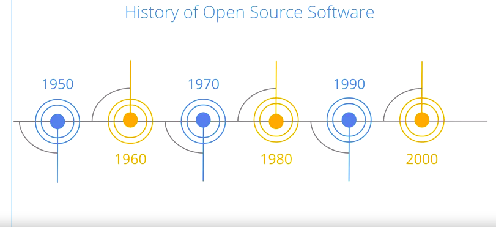
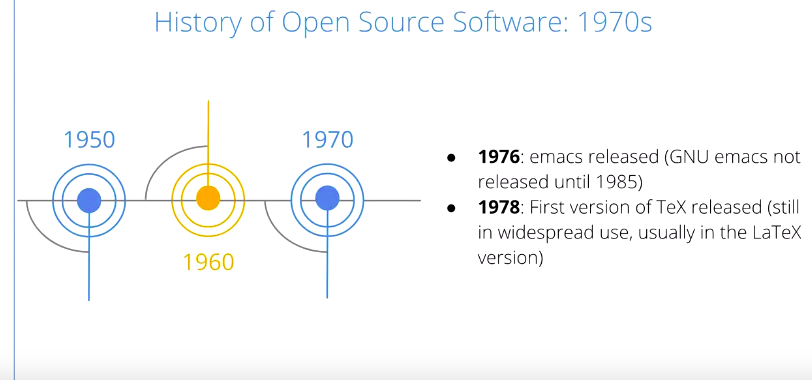
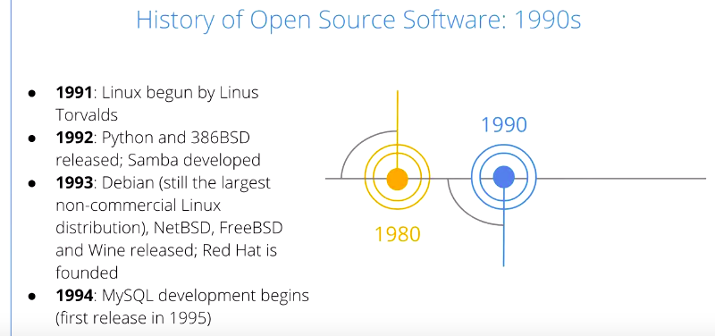
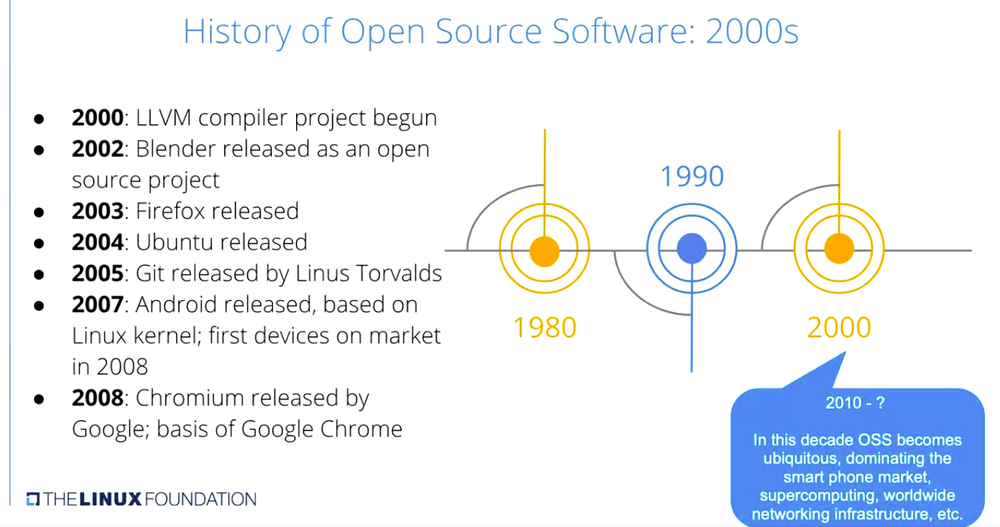
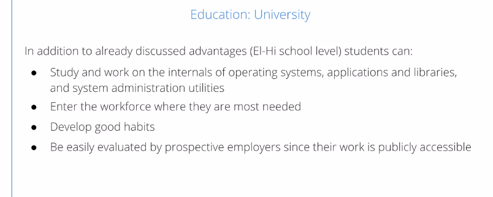
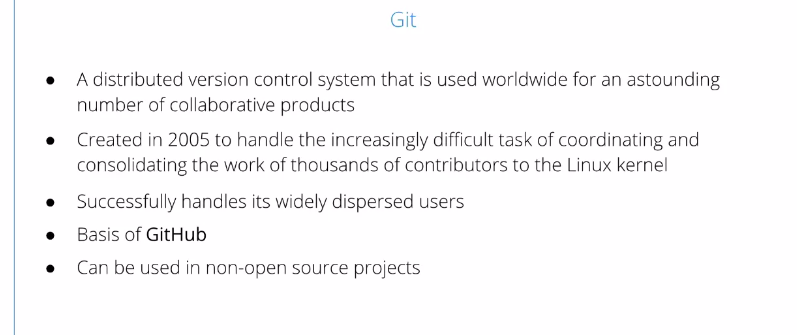
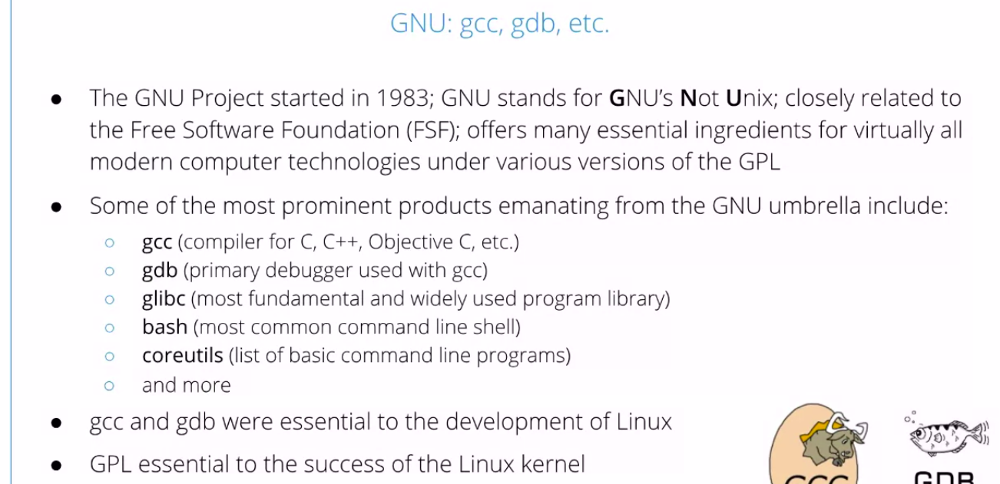

Open Source Software Development Methods
=========================================

by The Linux Foundation

# Module 1

#
## Title: Open Source Software

## Open Source Software

### What is Open Source Software?

> The word "free" can have two meanings - not limited or not controlled, or it can refer to no cost or no payment

* There are two types of open source software licenses: permissive and restrictive.
	* **A permissive license**, sometimes called a BSD-like license is a free software license that allows you to make any changes to the code as long as proper attribution is provided; as a contributor, you are not required to make your changes available to the original code creators
		* Permissive licenses are often preferred by companies
		* Examples of permissive licenses are MIT License, BSD licenses, Apache license, etc.
	* **A restrictive license**, sometimes called a "copyleft" license, allows you to freely distribute copies and modified versions of software as long as the same rights are preserved in any derivative work
		* It requires you to make all changes available to all recipients of your product
		* Examples of restrictive licenses are the GNU General Public License (GPL), Creative Commons share-alike, etc.
* Two meanings of Word "Free"
	* Free as in __not limited/controlled__, as in freedom of speech and freedom to distribute
	* Free as in __no cost/payment__, or as is often said "free beer"
* In 1998, people began to use the term open source to be clearer about what was meant by freedom.
* **Open Source Software** - Generally means that : Source code is made available with license which provides rights to **examine the software**, **modify it**, and **redistribute** to other people, without restriction on the user's identity or purpose
* Licensing Classification
	1. Permissive
		* Any code changes need not to be available to recipients
		* Often preferred by companies
			* This is often preferred by companies, because they're reluctant to give all their changes out to other entities
		* Example - BSD Licensed software
	1. Restrictive
		* Any code change must be available to all recipients
		* Sometimes called "Copyleft" license
		* Example - GPL-licensed Software

### What Is Proprietary Software?

* For **proprietary software** only software owners, those who distributed originally, have the full legal access to the source code
* Owner may give trusted partners the rights to inspect the code, especially if they want to develop companion products, but they will be forced to sign a non-disclosure agreement or NDA, and the source remains closed to a wider audience
	* It may be the case that the owners wrote the code or they may have bought it from somebody else, etc
* If you use proprietary software, you have to sign a license and that license will restrict the rights. Such licenses generally say you can't redistribute the software
* License protect the owner of the software from any damages that would be due to either the misuse or malfunction of the software, in other words they identify the people you got the software from
	* And you're not allowed to reconstruct the source code or use inside another product
* Price is not the point
	* Proprietary Software may be cheaper in terms of total cost of ownership than using open source software
	* Open Source Software the license permits you to redistribute, modify, reuse the code, adapt it to your needs, etc.

### Pragmatism vs Idealism

* __Pragmatism__
	* The primary considerations are technical:
		-faster and better development (e.g. more contributors and review)
		-easire debugging
		* This is due to having more contributors, more reviewers, more eyeballs, easier debugging, much easier implementation of continuous development and continuous integration methods to have a more rapid turnaround of changes
* __Idealism__
	* "Free" as in freedom, not beer
	* Software open for ideological and ethical reasons, not just technologicl ones

### History of Open Source Software

> Linus Torvalds developed the first version of the Linux operating system while studying at the University of Helsinki, Finland in 1991

  

  

  

  

  

  

  

  

### Open Source Governance Models

* The three open source governance models are:
	1. Company-led
	1. Benevolent dictatorship
	1. Governing board
* **Governance Model**
	1. Any project needs organization to achieve its purpose
	1. How decisions get made and who makes them required careful thought
	1. a project can still be open source, no matter what choices are made for these parameters
		1. Whether or not anyone can contribute, or only a few people can contribute
		1. Whether decisions are made democratically, or by some clear central authority
		1. Whether or not plans and discussions are made public before releases, or actually put out in the wild
	1. How this is done determines the Governance Model
* **Company-led** process, which is mostly closed, but the final release is all open source
	* So, one entity will control the software design, development and releases
	* There may be external contributions and opinions and review, but it's not necessary that the company actually take them into account
	* Plans and release dates may be described openly or they may be kept kind of closed and not discussed in advance
	* may not have a window into internal discussions, controversies and decisions that are made
	* However, once the software is released, it's completely in the open
	* Example
		1. Google Android, where the source is completely open, but very little is disclosed to the general public before the release is made
* The **Benevolent Dictatorship** model has strong leadership
	* it has one individual that makes the final decisions and has overriding influence
	* Whether or not this can work depends on the dictator's wisdom, as well as their actual capability and management of the process
	* The role is generally social and political, and not really structural, especially if they are using Git as a revision control system
		* As things evolve and scale up to larger sizes, the maintainers will tend to write less and less code and do mostly review
	* One advantage of having a strong leadership model is that endless discussions can be terminated at the discretion of the so-called dictator
		* **dictator here is not necessarily meant in a negative sense, it just means a strong leader**
	* Example, of course, is the Linux kernel led by Linus Torvalds, Wikipedia is another example.
* **Governing Board**, where you have a tighter control by a smaller group
	* All discussions are out in the open, on mailing lists, or chats, or any other form. And decisions about who contributes, how patches are accepted, new software is accepted, are made by that governing body
	* There's a lot of variation in the governing structures, from very loose to very tight, Democratic votes versus rule by consensus, etc
	* Tend to get less frequent releases, but often they're very well debugged hopefully
	* Examples are the FreeBSD operating system or the Debian Linux distribution

> A good example for the **company-led governance model** is **Google's Android project**. This is a mostly-closed development process, where one entity controls the design, the development methods and the release schedule. Contributions from external contributors may or may not be solicited. Plans, release dates, future features are usually not made public ahead of time, but, once the software is released, it becomes available, and other people can reproduce the building of it. Red Hat Enterprise Linux is another good example for this type of governance model
#
> A good example for the **governing board method** is the development of **FreeBSD**. In this model, a small group makes the decisions through some kind of democratic or voting process. However, all discussions are generally done on open mailing lists. The governing structures, the rules of organization, the degree of consensus required, etc. varies from project to project. Using this governance type tends to lead to less frequent releases, but well-debugged code. Debian is another example of project lead by a governing board
#
> A good example for the **benevolent dictatorship** governance model is the **Linux kernel**. In this model, there is a strong leader that makes the final decisions and controls the project management. This is a very successful model for some projects: Linux, lead by Linux Torvalds, is the best known example, and Wikipedia, lead by Jimmy Wales, is another one. The project quality and success depend on the leader's wisdom and management capability, especially as the project matures and scales to a larger number of contributors. The leader's role may be social and political, not necessarily structural. As the project matures, the leader or maintainer will write less code, but will be heavily involved in the review and decision making processes

## Why Use Open Source Software?

### Advantages of OSS

* Collaborative development leads to a better and more secure product
* Collaborative Development
	* When a project is developed collaboratively by a diverse group of developers, maybe in different organizations, or companies, or geographic locations, one just has many more ideas to draw on, and one can build better software
		* Because not everybody is always trying to solve the same problems, they can build on the work of others.
	* Furthermore, just having more eyeballs viewing the code and more groups testing it, leads to a better and stronger and more secure product when it's actually deployed
	* It's often very difficult for competitors to really get used to the idea of sharing and seeing that the benefits can be greater than the costs in using the open software model.
	* It enables competitors to compete on parts that users actually see, rather than the internal plumbing which can be shared between different competing organizations
		* leads to a stronger product and one which can be developed more quickly
* Security and Quality of Code
	* Coding standards and styles tend to be cleaner and more consistent on community projects
		* It's embarrising to show ugle, sloppy code
		* More people have to understand and work on the code
	* More eyeballs examining the code looking for security weakness before they are discovered by bad actors
	* More inputs in original design to avoid bad ideas
	* No "Security through obscurity"
		* You get rid of the concept of "security through obscurity". Having open source enables a lot of people to look for the security flaws and quickly publish fixes to them, so you don't have to just trust people
	* No "just trust me"
	* Potentially faster bug repair
* Stakeholders
	* Some of the stakeholders benefiting from OSS include
		1. Users
		1. Business
		1. Education
		1. Developers
	* These are overlapping categories, obviously. Businesses use the code, as do educational institutions, for example. And developers will work for businesses or educational institutions also
* Users : Flexibility
	* They can mix and match software that comes from different projects and different sources
	* It's obviously cheaper in most cases than buying or leasing software
		* And you don't get locked into specific vendors, you can keep your choice going forever
	* Avoid vendor lock-in, maintain choice
	* Look under the hood - 'Trust but verify'
		* you don't have to just trust somebody who will develop your product
			* Is very useful, especially if you have the knowledge to really understand the code
	* It's fun having more choices
* Business : Collaborative Development
	* Lowers total cost of development
	* Speed up time to market
	* Encourages community feedback
		* Criticism
		* Suggestions
		* Contributions
		- Having a lot of community feedback, criticism, suggestions, also lets you gain resources beyond actual employees
	* Supports upstreaming to reduce future costs for new products that reuse code
		* things in upstream products, in other words, products that your product requires, if you see things which require a change, or improvement, or fixes, you can work on that product as well, or at least feed your suggestions and code changes to the upstream people, so they don't have to do all kinds of workarounds on your product, to deal with what you perceive to be weaknesses in the upstream product
	* Uses well-defined APIs
* Business : Marketing
	* customers know what they're getting. There's no secrets, so they can have confidence in the quality
	* There will be a large ecosystem of related products, not just yours. So people can see how it all fits in
		* Product is seen as being part of a large ecosystem of related products
	* There's a very modular construction, where different pieces can be plugged in together, both from within your suite of products, as well as in other organizations or companies' products
		* More flexible, possible modular construction
	* If a large community adopts a product, then customers will have confidence the product is here to stay, it's not going to be abandoned no matter what happens or that the development will stop
		* Adoption by large community can lead to customer confidence product is here to stay
* Education : Elemantary - High(El-Hi) School, Public Systems
	* lot of resources available for teaching, as well as the software itself at little or no cost
		* In many different areas, including operating systems, applications, administration, programming, etc., and students are not just trained in one company's products which are popular now, but may not be popular in the future
	* Software itself is very cheap or free. And in many cases, you can use much older hardware than you can if you're using proprietary vendor products
	* Students will learn skills they need in the workforce
		* they will have more fun due to the flexibility and they will unleash their creativity
* Education : University
	* Students can get real practical work on the internals of operating systems, applications, library system administration
		* Most universities today use Linux to study operating systems, rather than some of the other operating systems that are associated with particular companies
	* They will gain workforce skills that are needed when they graduate and just generally develop good habits
	* Having to work with an open community leads to good habits in terms of clean code and being able to handle criticism and make criticism without being sensitive and just generally work well and play with others
	* Be easily evaluated by prospective employers since their work is publicly accessible
		

		  
		

* Developers
	* If code be public, means that a prospective employer can really evaluate them in a way they could not do if it was not open source
	* don't have to reinvent everything, you can build on the work of others or standing on their shoulders
	* Good decisions can be made early in product design by having more input
	* Likewise, having more people look at the code as we said before, builds a better product and finds bugs more quickly
	* having suggestions from a larger group is rather helpful
		

		  
		

* What are some of the advantages of open source software development? Select all answers that apply.
	1. Stronger and more secure code
	1. Developers have the means to build better software
	1. Reduced costs
	1. Potentially faster bug repairs

> In order for collaboration efforts to be successful in an open source project, usually, certain code and style standards exist. In such cases, the code will tend to be cleaner and more consistent. This forces many developers to write cleaner code, to avoid the embarrassment of other people looking at ugly and sloppy code. Also, this makes it easier for people to comprehend the code and work with it, making improvements to it

## Successful OSS Projects: Examples

### Successful OSS Projects

* The most successful examples and long-standing examples of open source software projects
	1. Linux Kernel
		* Began in 1991 as Linus Torvalds' student project
		* It has been under an open source license, the GPL, since its earliest days
		* Almost all the world's computing infrastructure now is based on Linux, 100 percent of the world's super computers for example, as well as the largest number of mobile devices since Android is based on Linux, in fact is Linux in terms of its kernel
		* Linux can be found in an enormous range of devices, such as medical devices, other embedded products, probably whatever you're using in your home entertainment systems, as well as personal fitness devices such as Fitbit
		* There is a very large and mature development community of literally many thousands of developers
		* The pace of development is extremely rapid. New versions come out every 10 to 12 weeks, and thousands of lines of code are added and removed every single day
			

			  
			

	1. Git
		* The Git distributed version control system arose out of the Linux project in 2005, as the project really scaled to thousands of developers in a very frequent pace
		* It is specifically designed to work with a very distributed and far-flung group of contributors
		* GitHub, which hosts literally millions of products, is entirely based on Git
			* There's no requirement that you have to have an open source project to use Git
			* It can be used in proprietary projects, as well in private repositories
				

				  
				

	1. Apache
		* The Apache Web Server began in 1995. Today, it's the most widely used web server
		* It's produced by the Apache Software Foundation. Released under the Apache Software License, which has been used by many other projects
			* It's a more permissive license than the GPL, which is a so-called restrictive license
		* It's very hard to overestimate the importance of Apache. There are many sub-projects and related projects that are found in every corner of the international infrastructure for computing
			

			  
			

	1. Various Languages Developed under OSS
		* Languages such as Python, and Perl, and Ruby, etc, are developed in an open source method
		* Languages like C, I should say, are developed by international standards bodies, but then the implementations are developed with open source methods
			* So, for C, for instance, you have both GCC and the LLVM project releasing compilers
				

				  
				

	1. TeX and LaTeX
		* TeX and LaTeX began in 1978 as a project by Donald Knuth, who's a very well-known computing science professor, who is extremely respected for his development of algorithms, as well as TeX system
		* It's actually a typesetting system
		* It's much more than a word processor, but it's still used to produce many documents, books, slides, talks, especially in the academic community
		* There's an extremely active and very large community, constantly inventing new extensions to TeX, as well as international support for languages, etc
			

			  
			

	1. GNU: gcc, gdb, etc
		* The Free Software Foundation is in charge of the GNU Project, or GNU's Not Unix
		* many of the essential ingredients that people use everyday come from the GNU Project, including
			1. gcc - the compiler, the debugger
			1. gdb, glibc, which is the library that almost all programs have to use
			1. bash, which is the command line interpreter
			1. coreutils, as most of the basic command line programs
		* System administrators and developers use everyday come from this project
		* Without the GNU Project, Linux would never have been able to develop at the pace that it did
			

			  
			

	1. X and Desktop Managers
		* The Window and desktop interfaces people are used to using for instance on Linux systems, as well as other systems, such as FreeBSD, are developed in an open source manner
		* The X Windows System and the desktop environments, GNOME, KDE, XFCE, and others were all developed using open source methods
			* There are many other widely deployed projects which are developed openly with open source methods
				

				  
				

	1. OpenStack, Kubernetes and Other Projects
		* OpenStack and Kubernetes are extremely widely used in very hot projects today
		* we list some of the others, such as ONAP for networking, Hyperledger for blockchain, etc
			

			  
			

* SUMMARY
	* **Kubernetes** is an open source container orchestration system for automating deployment, scaling, and management of containerized applications. It was originally designed by Google, but then open-sourced when it reached v1.0. Currently, it is maintained by the Cloud Native Computing Foundation, under the Linux Foundation umbrella.
	* **ONAP**, or **Open Networking Automation Platform** is an open source networking project hosted by The Linux Foundation.
	* **OpenStack** is an open source software platform for cloud computing, currently managed by the OpenStack Foundation.
	* **Hyperledger Fabric** is an open source enterprise-grade permissioned distributed ledger technology platform. The project is hosted by Hyperledger, under the Linux Foundation umbrella.

