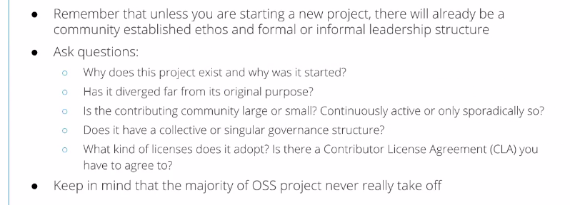
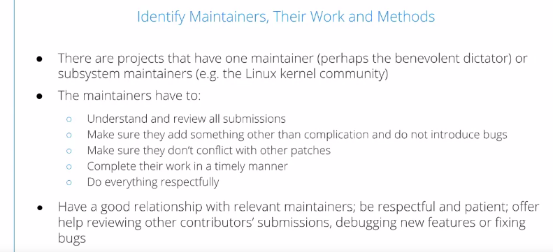
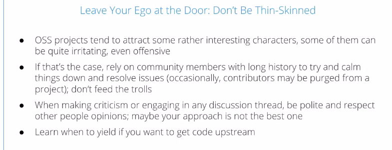
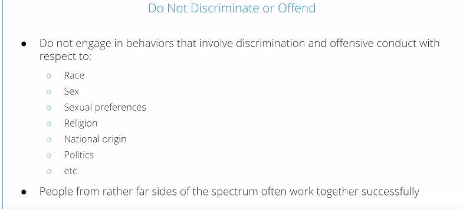
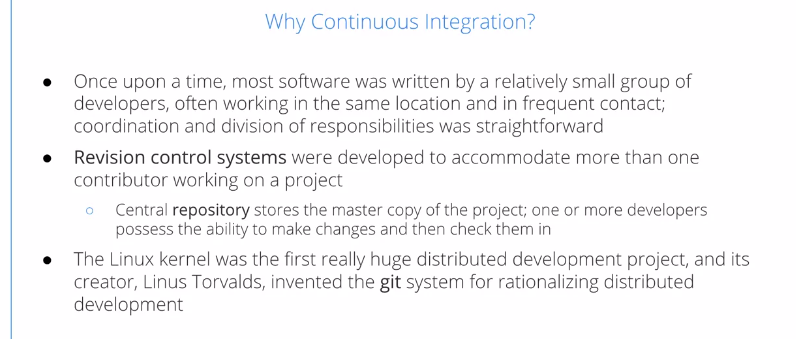
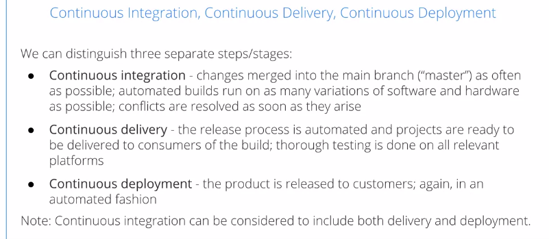
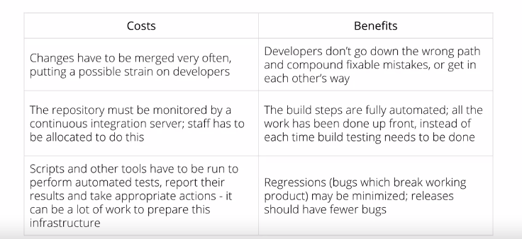
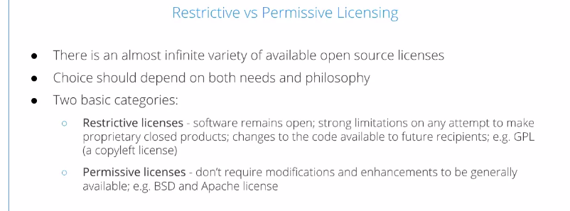
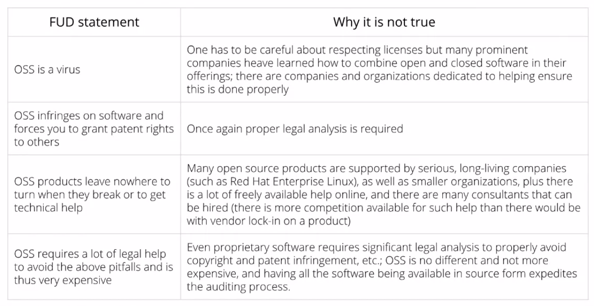

Open Source Software Development Methods
=========================================

by The Linux Foundation

# Module 2

#
## Title: WORKING IN OSS PROJECTS

## WORKING IN OSS PROJECT

### Contributing to OSS Projects

* How to contribute properly to OSS
	1. First, you need to investigate the project, understand its style, what the workflow is, what the scope of the project is
		* So that you don't try to bring in things that don't belong in the project, or at least without requesting that people consider it
	1. See what communication methods the projects use
		* Usually, there's mailing lists, there are archives of mailing lists, so you can see the history, and maybe chat rooms that you can plug into
	1. How are contributions made? Are they done through revision control systems such as Git? Are they done through email etc
	1. Learn the previous history
	1. Before beginning to code, it's often good to volunteer your services for testing, finding bugs, etc
		* This is one place that projects are often short on help.
	1. Don't use the project to learn a programming language or a scripting language, or at least don't ask for help for that. That's not what the project is doing
	1. It's important to ask for review and suggestions early when you start to contribute, and don't wait too long and then dump a lot of work on people at once, since they will not be able to digest it
	1. Being polite, respectful, avoiding contentious discussions, and certainly not using obscenities, or other bad behavior, and trolling is important to take into account
		

		  
		

		

		  
		

* Study and Understand the Project DNA
	* The project has its own DNA
	* There's already an established community and ethos, there's a leadership structure. Make sure you understand what it is
	* Know where the project came from, ask questions
		1. Has it changed a lot since it began?
		1. Is this a large project, a small project?
		1. Is it very active, or is it pretty much quiet, with sporadic burst of activity?
		1. Does it have a collective or singular governance structure?
			* In other words, is there like a committee that decides everything?
			* Or one or two individuals that make the final decisions?
		1. What kind of license does the project use for its software?
		1. Does it require contributors to sign an agreement and signing their rights or does it not?
			

			  
			

* Figure out what itch you want to scratch
	* Most open source projects start out nicely and never really take off. It takes a particular opportunity of a need for project, as well as good governance and good contributors to make something succeed
	* Most contributors get involved in open source projects because they have a reason to
		1. There may be some bug or a problem that interferes with their use
		1. They want to learn or add some new functions to their work
		1. they just want to learn something new
	* There's often a list of relatively simple cleanup things to do or other simple tasks, sometimes called a **janitor's list**
		* This is a good thing for people to do when they start
	* It's also important that you shouldn't just start with trivial patches, that maybe change white space in code or other things
		* While these things will be accepted, it's very hard to find people who eventually went on to become important contributors who started out with this trivial work

> You cannot simply jump in and start contributing to an open source project. Before you start contributing to an open source project, it's important to understand the ecosystem, the community and the methods of the project. First, you need to investigate the project, understand its style, what the workflow is, what the scope of the project is, so that you don't try to bring in things that don't belong in the project, or at least without requesting that people consider it
#
> Most open source projects actually fail. It takes a particular opportunity of a need for project, as well as good governance and good contributors to make something succeed

### Tips for Successful Contributions

* Identify Maintainers, Their Work and Methods
	* There are projects that have one maintainer ( perhaps the benevolent director ) or subsystem Maintainers
		* Example, the Linux kernel Community
			

			  
			

	* The job of a maintainer is to understand and review everything that is submitted as a patch to the work
	* The maintainer also has to make sure the work doesn't conflict with work submitted by other people, they have to do their work in a timely manner, and not leave people impatient or dissatisfied, and they have to treat people with respect
	* It's very important to have a good relationship with the maintainers you need to deal with
		1. Be respectful
		1. be patient
		1. also be helpful
		1. review other people's submissions
		1. help debug things
		1. don't just expect service on your own work
* Get Early Input and Work in the Open
			

			  
			

* Contribute Increment Bits, Not Large Code Dumps
			

			  
			

	* It's important to contribute your work in digestible pieces, in small meals, not in very large code dumps
		* People get overloaded, and overwhelmed when you give them a lot of code at once and it's very difficult to test individual parts if a lot of things are done at once
	* It's okay if not everything will work until you're done, people can still digest things bit by bit with the idea in the end it will all work
* Leave Ego at the Door: Don't be Thin-Skinned
	

	  
	

* Do Not Discriminate or Offend
	

	  
	

* Be Patient, Develop Long-Term Relationships, Be Helpful
		

		  
		

	* Be patient! Don't expect everything at once. Long-term relationships will really pay off
	* There are contributions which are rejected, because somebody just throws them over the fence, and leaves and doesn't intend on maintaining them for the future, so even if the work is good, it's unacceptable to include it

> It's rare that people have to be removed from a community, but it does happen. If somebody is being offensive, it's a good idea to rely on members of the community who have been around for a long time to try to calm things down, resolve issues, and let them be the one that get rid of trolls if necessary. It's very important to be respectful towards all members of an open source project community.

* What is the job of an open source project maintainer? 
	1. A maintainer will help resolve conflicts between contributors
	1. The job of a maintainer is to understand and review everything that is submitted as a patch to the work
	1. The maintainer has to make sure the work doesn't conflict with work submitted by other people

## Continuous Integration

### Continuous Integration

* Why Continuous Integration
	

	  
	

	

	  
	

* Continuous Integration, Continuous Delivery, and Continuous Deployment
	1. Continuous Integration
		* Continuous Integration is to constantly merge any changes into the main branch of the software and to run automated compiles and builds, with as many variations of platforms, software, or hardware as possible, so that any conflicts are nipped in the bud before they become rather bad
	1. Continuous Delivery
		* Continuous Delivery phase means that, once you have integrated changes, you have a quick and automated process of delivery or release, and it's released to consumers of the build
		* This might be companies, etc., that are using the software which they're going to distribute to end users
	1. Continuous Deployment
		* Continuous Deployment, where you release the actual product to customers
				

				  
				

	* NOTE: Sometimes, Continuous Integration means all three phases together and includes both Delivery and Deployment
	* Graph
		* Graph that shows how it all goes in a continuous circle
		* The time gap between the steps is meant to be as close to zero as possible
		* In some cases, developer changes can even reach user customers in the same day, or even within minutes or hours when everything is working very cleanly
				

				  
				

* Costs and Benefits
	

	  
	

* Tools
	* There are many well-developed continuous integration software tools, like
		1. Jenkins (most widely used tool)
		1. Travis
		1. TeamCity
		1. GO CD
		1. GitLab CI
		1. Bamboo
		1. Codeship
		1. CircleCI
	* Some of these products are free of cost, but others are not
* Questions you have to consider when testing to ensure all pieces of a distributed development project work as expected
	1. Can changes that overlap with each other be applied at the same time?
	1. Are there good test suites that can be used on representative workloads, to ensure things are working properly?
	1. Does the project still compile?
	1. Do changes that overlap with each other conflict?

> A **revision control system** helps streamline the work in distributed development projects, but doesn't solve the problem of making sure that things actually work. If there are people working on different parts of a project, from different angles and locations, all the pieces have to mesh together and not conflict. Solving one problem should not create another one in another area

## OSS Licensing and Legal Issues

### OSS Licenses and Legal Issues

* There are many kinds of open source software licenses, but they fall into two general categories 
	1. __Restrictive license__
		* In a **Restrictive License**, the software remains open, but there are strong limitations on any attempt to make closed products which depend on your software
		* Any changes to the code actively made available to future recipients in a way they can rebuild their product
		* The most prominent example is the **GPL**, the **General Public License** from the Free Software Foundation, which is also known as a **copyleft license**
			* The Linux kernel is released under a GPL license
	1. __Permissive license__
		* **Permissive licenses**, in general, don't require modifications and enhancements to become generally available, even if it's used as a proprietary product
		* Prominent examples are the **BSD** and the **Apache licenses**
			

			  
			

* Choosing a License
	* One should be very careful while choosing a license as it's a very important decision
	* It's good to have a thorough discussion early in the development of a project, because switching to a different license later can be rather difficult, especially if there are many contributors who have rights and have different opinions about what should happen
		

		  
		

* Fear, Uncertainty and Doubt
	* There is a lot of misinformation spread about open source software licenses. This falls under the general category of FUD, or Fear, Uncertainty, and Doubt
	* This term actually goes way back as far as the 1920s, but the FUD acronym seems to first be used in the 1970s
		* It means disseminating misinformation to influence people to avoid products and strategies and classes of products by appealing to their fear
	* Microsoft was widely accused of spreading FUD about Linux in the 1990s
		

		  
		

* Why is the statements that FUD make generally false?
	* A prominent one is that OSS is a virus
		* In other words, if you use any open source software in your product, you will have to open up the source to your entire product
		* This is **not true**. Many prominent companies have learned how to both combine open and closed software in their offerings
	* The second one is that open source software infringes on software and patent rights, and forces you to give patent rights to others
		* Once again, you need proper legal analysis, but it certainly is not generally true
	* A third one is that open source products do not offer you help when things break or if you need a technical support
		* That's absolutely untrue
		* Many open source products are supported by serious mature long living companies such as Red Hat Enterprise Linux, as well as many smaller organizations, and there's a lot of freely available help online and communities that can support you and help you solve your problems
	* Open Source Software requires a lot of legal help to avoid pitfalls, such as the statements we just discussed, and so, therefore, it gets very expensive
		* This is nonsense
			* Even proprietary software requires significant legal analysis to properly avoid copyright and patent infringement and other problems
		* In fact, open source software sometimes makes it easier, since everybody can see what the actual software is. User can quickly catch any things which might present legal problems
			

			  
			

* Legal Issues
	* No matter what kind of product you have, you'll have to interact with lawyers. They may be on staff, they may be external, but somebody will have to make sure you're not violating copyrights and licenses
	* Part of this training is making sure developers understand what the do's and don'ts of working with open source software is, So they don't accidentally or ignorantly violate rules and incorporate things in their source, in their product which shouldn't be there
		

		  
		

* What license is the Linux kernel released under?
	* GPL-2.0 License

> You have to carefully choose the license for your project, as it will be very difficult, if not impossible, to change it later on (especially if multiple contributors are involved)

### Patents and Licenses

* Software Patents
	* A **patent** gives exclusionary rights to the owners of the patent
		* It could be rights to the program, the source code in the program, library interfaces, and in some cases unfortunately even techniques and algorithms
	* User have to file for patents in every nation or a trading block such as the European Union for which you would like coverage for the patent
	* This is very **expensive**, **time-consuming**, it's something that generally only larger companies can afford
	* Exactly what the patent can cover varies from place to place
		* For instance, in the United States there is an exclusion of "abstract ideas".
			

			  
			

* Do we Need Software Patents?
	* That's a debatable issue and there are some people who believe there should be no software patents at all
	* __Notice__ copyright is a different question
		* __Copyright__ controls whether or not your work can be explicitly copied and plagiarized and taken directly
	* __Trademarks__ protect your brand name or a product name, etc., from use illegally by somebody else
	* Very often software patents are used in a defensive manner
		* One corporation cross-licenses the patents of another corporation and this way they avoid ever suing each other
			

			  
			

* __Open Invention Network (OIN)__
	* The Open Invention Network, or the OIN, is very important
	* It was founded in 2005 and now has over 3000 members including very influential companies with a lot of patents including
		1. Google
		1. IBM
		1. NEC
		1. Phillips
		1. Red Hat
		1. Sony
		1. SUSE
		1. Toyota
	* Since 2018 Microsoft, which came in and brought with it 60000 patents
	* This is a global patent pool and any company that joins the OIN enters into a non-aggression agreement with the other members and agree not to sue each other over patent issues as long as people respect the issues of their membership
			

			  
			

* Patents and Licenses
	* Now, some licenses talk about patents and some don't
		* On the column on the left we mentioned licenses which do have some discussion of patents
		* Ones on the right, which generally do not
	* Notice for instance 
		* the Apache license talks about patents
		* GPL version 3 does not, but GPL version 2 does
		* The BSD licenses do not talk about patents
	* Sometimes projects will have a separate file that explains their attitude about patents might be called licenses, might be called patents, and it'll be in the source code
			

			  
			

