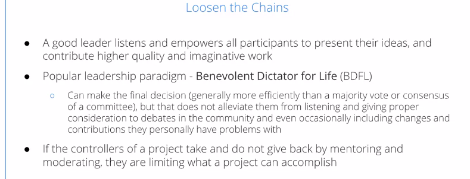
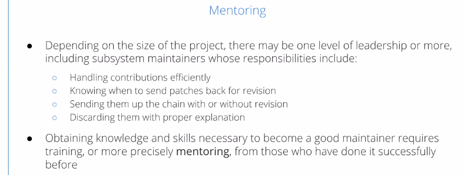
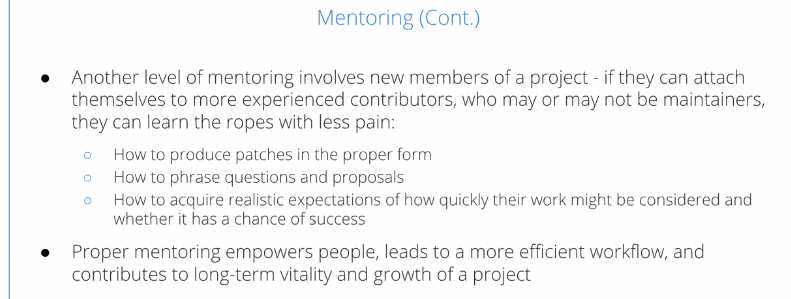
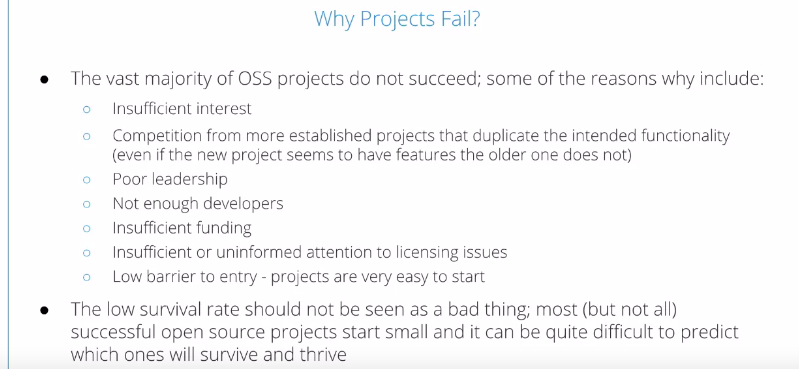
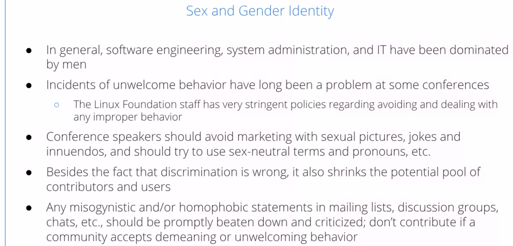
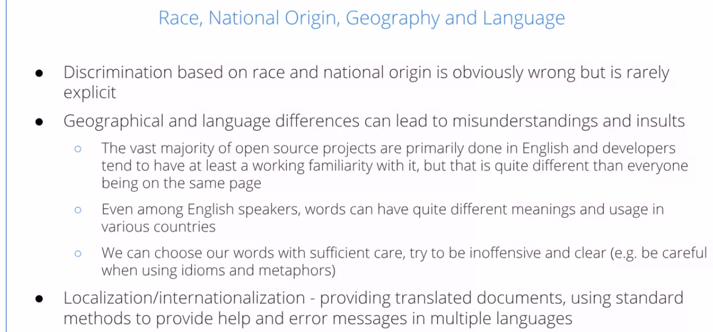
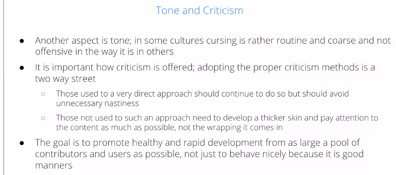
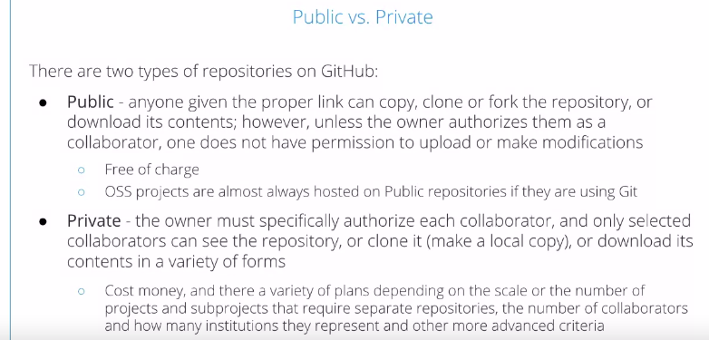
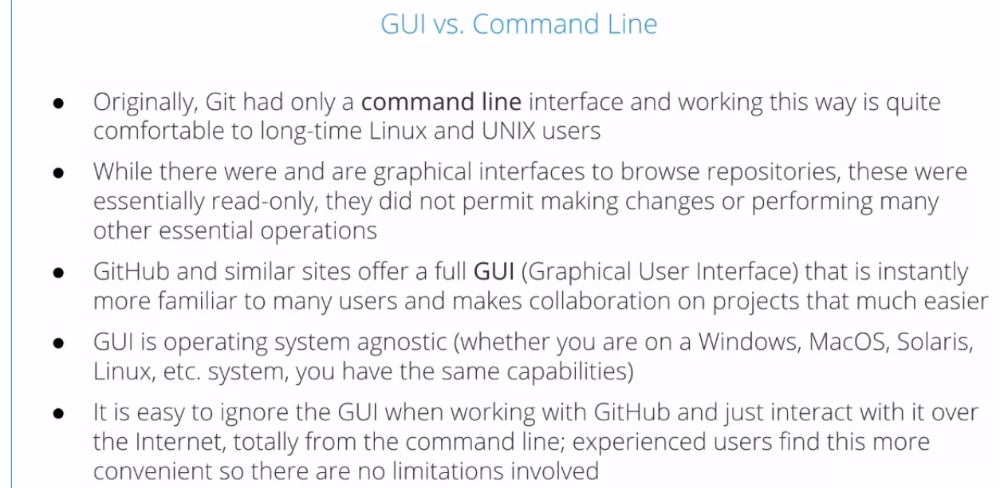

Open Source Software Development Methods
=========================================

by The Linux Foundation

# Module 3

#
## Title: Building Better OSS Projects

## Leadership vs. Control and Why Projects Fail

### Leadership vs. Control

* There are many ways a project can be lead, ranging from rather tight control to downright anarchy
* It's important to lead your project to encourage getting the maximum out of all the participants, and having an efficient workflow as supposed to just keeping a tight control over it
* Loosen the Chains
	* A good leader listens and empowers all participants to present their ideas, and contribute higher quality and imaginative work
	* One popular leadership paradigm is the so-called __Benevolent Dictator for Life__, or __BDFL__, of which the Linux Kernel is a prime example
	* While there may be a very extended and thorough discussion between participants about what should go in or not go in, and how to fix things, ultimately, the decision is made by one or a very small group of individuals
	* This works well if the project controllers also really listen and mentor the participants in the project
		

		  
		

* Mentoring
	* Depending on the size of a project, there maybe one level of leadership or more, including subsystem maintainers whose responsibilities include
		1. who have to know how to handle contributions efficiently
		1. know when to ask for revisions
		1. know when to send them up without revisions
		1. know when to simply throw them away
	* It takes a lot of training to become a good maintainer
		* In fact, one needs to be mentored.
	* Mentoring is also very important when bringing in new members of a project, they can avoid rookie mistakes, and gain good credentials if they attach themselves to more experienced contributors to teach him 
		1. how to produce their contributions in the proper form so they're more easily accepted
		1. how to phrase questions
		1. how to have realistic expectations
		1. how to deal with things when things don't go their way
	* This empowers people and leads to a better workflow, and a more vital project
			

			  
			

			

			  
			

* Building Trust
	* It's very important to build trust, if there's no trust in an open source project, it cannot function
	* Contributors have to trust that their work will be treated with respect and be given consideration, and be given it properly
	* Leaders must trust their subsystem maintainers to have good decisions and be qualified, and must not micro manage everything they do
	* This trust has to be earned, and must go beyond the benefit of a doubt
	* As any project matures, people grow into their roles, reputations are earned, and new members will be aware of their history
		

		  
		

* Why is good leadership important for the success of an open source project?
	1. Mentor new contributors
		* Good leadership skills are usually acquired in time. Same goes for the skills needed to be a good maintainer. A good project leader will mentor contributors, helping then obtain the knowledge and skills needed to ensure a good workflow and high quality contributions. Onboarding new contributors is also a key factor for a successful project - this will allow new members to learn how to produce patches in the proper form, how to phrase questions and proposals, how to acquire realistic expectations regarding their work
		* Proper mentoring empowers contributors, leads to a more efficient workflow, and contributes to long term vitality and growth of a project
	1. Have an efficient workflow
		* A good leader will ensure that processes are in place to allow for a good and efficient workflow. Proper onboarding and mentoring of new contributors and project maintainers will also ensure the success of the project
	1. Moderate Conflicts
		* A good leader can help with conflicts that may arise between contributors (for example, due to divergence in opinions or different contribution ideas to improve the project), or if there are contributors with offensive behavior. They will moderate discussions, and intervene in situations involving improper behavior
	1. Encourage contributors to give their best work
		* A good leader listens and empowers all participants to present their ideas, and contribute higher quality and imaginative work
* Trust is vital for open source projects:
	1. Contributors must trust that their submissions will be treated with respect and given prompt consideration
	1. Project leaders must trust maintainers are qualified and capable of doing their job
	* Trust must be earned and must go beyond the benefit of the doubt
* A benevolent dictator makes the final decisions, but should listen and consider all community debates/suggestions

### Why Do Many OSS Projects Fail?

* Why Projects Fails?
	* First of all, there just may be insufficient interest
		* It may have seem like a good idea to somebody at the time, but it just didn't take off
	* It also could be that they're more established projects that do the same thing or close enough to the same thing
		* So that it's just not worth it to people to migrate to a newer project with an unproven record rather than just keep working or improving the old project
	* There could be poor leadership, that can take many forms, including 
		1. non-responsive leadership
		1. abusive leadership that doesn't value new contributors
	* There may simply be not enough developers to keep the thing going with any steam, and that's related often to the insufficient funding
	* Many projects are done by people on their spare time, but they can't really take off until somebody starts to get paid for doing it as part of their job
	* Licensing can be sloppy and people will be unwilling to contribute to something which has unclear or unfavorable licensing situations
	* There's a low barrier to entry, it's very easy to start a project, it's much harder to make them continue and thrive
	* One shouldn't see this low survival rate as a bad thing
		* Everything has to start somewhere and it's nice that one can start pretty easily and then see how things turn out
		* Some of the most successful open source software projects that are widely used today began out rather small, with a small group of people, and then took off
			

			  
			

* When it comes to open source projects, there are millions of projects that are created. However, a relatively small number go on to become successful projects. A number of factors will influence the chances of succeeding, such as
	1. The need the project is trying to address
	1. The number of contributors and contributions, as well as the workflow in place
	1. Poor leadership
	1. Insufficient funding, etc.

## Respecting and Encouraging Diversity in OSS

### Diversity in OSS

* Diversity and OSS
	* While the word open appears in Open Source Software, it doesn't mean there's always a friendly and welcoming environment
		* Badly managed projects can violate this rule and sometimes close-minded people can be involved in an open source project
	* There are many kinds of diversity that we can talk about, such as race and national origin, sex and gender identity, geographical and language issues, as well as just acceptance of different opinions, religious beliefs, political views, and methods and opinions about how projects should be worked on
	* While it's just generally the right thing to do, to accept contributions from many places and encourage diversity, it also leads to a better and stronger product
		

		  
		

* Sex and Gender Identity
	* Software engineering, and the computer industry in general, has been dominated by men, in particular white men, for a very long time
	* While there have been many cases of unwelcome behavior at high tech conferences over time, The Linux Foundation has a very stringent policy against this and dealing with it
	* Conference speakers should avoid various kinds of behavior which, even if accidental or offensive to people
	* Any kind of misogynistic, homophobic, racist statements, etc, and mailing lists, discussion groups, should be properly beaten down and reported to moderators and senior members of a community
		

		  
		

* Race, National Origin, Geography and Language
	* One should not discriminate based on race and national origin, but sometimes this discrimination takes more subtle forms
		* For example
			* There could be language differences based on the fact that for some people, English is a second language, and other people are quite comfortable with 
			it
				* Even if English is your native language, the same words can have different meanings in different regions, such as the United States, India, Great Britain, etc
			* So, we should choose words with some care and try to avoid excessive use of idioms that will not be understood
	* Some projects do a lot of localization, internationalization, including translation. Other projects really just don't have the bandwidth or interest in doing that
		

		  
		

* Tone and Criticism
	* Criticism and discussion should be done politely as possible, one should avoid using any kind of nasty language, much less obscenity
	* However, if you are criticized strongly, you should avoid responding in kind, you should turn the other cheek, develop a thicker skin and pay attention to the content, and not exactly how it's delivered
	* Once again, if it gets unbearable, it should be dealt with by senior members of the group, rather than taking the bait of trolls
		

		  
		

* Religion and Politics
	* Religion and politics, generally, they should be off-topic in most groups
	* However, occasionally, it's impossible to eliminate completely especially since questions of freedom of expression, etc, will tend to come up in Open Source Software, but one should be careful, once again, to be respectful and avoid off-topic political discussions, and almost always any discussion of religion is just simply not sensible
		

		  
		

* Differences in Opinion
	* People have different opinions. One should be able to listen to other opinions, not be harsh about them, you should be able to divide work amongst different groups or individuals and be able to merge it later, accept it, take revisions, etc
	* Occasionally, somebody may want to do something in a different way from your approach, and even if you think yours is better, if it does not prevail, you will need to accept the other approach and maybe work to improve it
		* You just cannot be too wedded to your approach
	* If there's more debate and more opinions expressed, a better project can be built
		

		  
		

* When it comes to open source software projects, what does diversity refer to?
	* Because contributors to open source software projects are very diverse, from all over the world, with different backgrounds, diversity is a very important topic in the open source world. The success or failure of open source projects can be heavily linked to diversity. Diversity leads to better projects, as more sources of new ideas, approaches and contributions are unleashed. As such, diversity in OSS projects can mean different things.
		1. Sex and gender identity
		1. Religious and political beliefs
		1. Race and national origin
		1. Acceptance of different views related to how the project is managed and developed
		1. Language and cultural differences
* Discrimination has a very negative impact, and should never manifest itself in an open source project. Open source software communities, and not only should be open minded, respectful, and inclusive
* In OSS projects, collaboration is a key element. What are some ways that promote healthy collaboration among contributors?
	1. Be respectful and open minded
	1. Competition between differing approaches
	1. Divide work fairly among more than one group or individual, and merge later

## GitHub and Other Hosting Providers

### Github and Other Hosting Providers

* GitHub
	* GitHub and other hosting providers take a lot of the effort of doing this away from the project, and enable them to concentrate on its actual work
	* The Git revision control system itself began as an offshoot of the Linux kernel development community, and was created by Linus himself in 2005
	* It could easily be used for any project with similar needs, primarily having a large geographically separated group of contributors in a very open development method and many frequent releases
	* The GitHub site was founded in 2008 and it has grown exponentially
		* In 2018, it had 30 million users and 60 million repositories
	* Before wide use of GitHub and similar websites, projects needed to set up their own servers to host repositories, set things up, administer, make sure things are secure, etc
		* By using GitHub and others, a project can concentrate on its actual code and not having to deal with that sort of thing, though some projects obviously still do it themselves
		

		  
		

* Other providers are **GitLab**, **GitKraken** and **Launchpad**, that do similar things, though somewhat different, of course, than GitHub
	

	  
	

* Public vs Private Repositories
	* There are two kinds of repositories on GitHub
		1. Public Repository
		1. Private Repository
	* For a large-scale open source project, people generally use a __public repository__
		* Anybody can get permission to copy or fork a repository, download its contents
		* Uploading into the repository and making contributions requires permission that has to be given by whoever owns the repository
		* It's the vast majority of open source projects are hosted on public repositories
	* With a __private one__
		* the owner restricts access to a named list of collaborators and only those people can actually use the repository and be able to update it
		* This costs money though it's not expensive, and it's used by many organizations for proprietary code or for even open source code that they're not quite ready to open up yet
			

			  
			

			

			  
			

* GUI vs Command Line
	* Git was written with only a command line interface, which GitHub certainly respects, but there's also a graphical interface or GUI which is easily accessible from any browser and any operating system
	* It's easy to ignore the GUI, if you want to just work from the command line and many experienced users find this a more attractive way to work
			

			  
			
